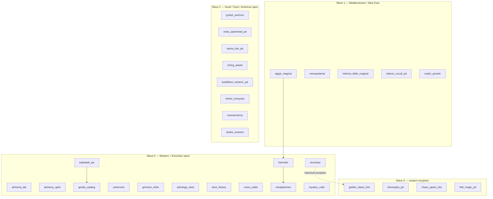

# Athanor Tradition Atlas (map)

## Continents (Wave)

## Lenses (every continent)

| Lens | Means | Does not mean |
|------|-------|---------------|
| Historical | Dating, transmission, editions | Fate / prophecy as fact |
| Symbolic | Structure, correspondences, mythic grammar | One true decoding |
| Operational | How historical practitioners arranged practice | Efficacy / summon results |

## Product fences

- Enochian / Goetia: **in atlas**, **out** of summon UX and authority-seal mint
- `efficacy` always null on packets
