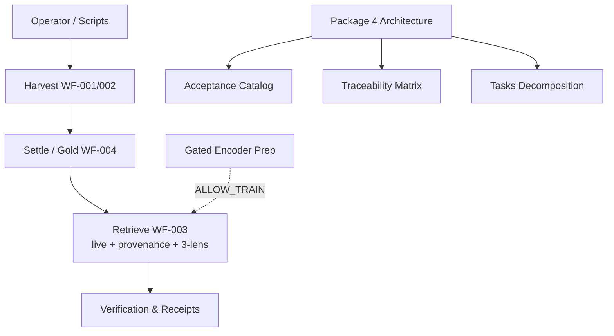

# Architecture — Athanor (Package 4 Draft)

Status: Initial text description. Diagrams to follow in later passes. This does not govern or activate.

## High-Level Layers
```
Operator / Notion / Scripts
          |
          v
Harvest (Crawl4AI 0.9.3, PD allowlist) → atoms.jsonl (local ~/.athanor)
          |
          v
Settle / Quarantine / Gold (scripts/shadow/ + admission_approval)
          |
          v
Retrieve (Spec 001 live)
  - load_atoms
  - rank_atoms (BM25-ish stdlib)
  - strip_chrome (retrieve-time)
  - build_packet (provenance + basic 3-lens synthesis)
  - CLI (doctor, retrieve)
          |
          v
(gated) Encoder Prep (Spec 002 P3a specify)
  - adapter_* (data, freeze, overlap, tokens)
  - readiness, quarantine
          |
          v
Verification / Receipts / Audits
  - pytest, ruff, contracts/verify
  - out/audit/
```

### Mermaid Diagram (Package 4 draft)


## Components
- **Core (shipped)**: src/athanor/{retrieve,chrome,entrypoint}.py
- **Data Model**: Atom (now with source_url, content_hash, lens_hints)
- **Synthesis**: Initial HERMENEUT via _build_lens_synthesis (family + hints driven)
- **Gates**: Fail-closed for train/Hub (no ALLOW_* artifacts in repo)
- **Specs**: 000 spine, 001 retrieve, 002 encoder (specify only), 003 Qwen (separate), 004 architecture (this)

## Non-Goals (per constitution)
- Efficacy claims
- Summon/compel UX
- Full SoT or gold in git
- Production weights without operator authorization

## Data Flow (High Level)
Harvest uses jev rerank for quality classification of candidates (PD-primary only, high relevance for OBSERVED). Settle/quarantine integrates jev scores. Retrieve uses the classified corpus. All classifying tasks route through jev per AC-JEV-*.

Jev is used for:
- Chunk quality ranking before adding atoms.
- Balance and epistemic checks.
- Replacing junk/low-quality with better primary sources.
1. Source → WF-001 (review/rights) → WF-002 (harvest/normalize) → atoms + receipts
2. Settle (quarantine/gold/approval) → eligible corpus
3. Retrieve (WF-003): load → rank (BM25) → strip_chrome → build_packet (provenance + 3-lens synthesis)
4. (Gated) Encoder: adapter prep → freeze → train/eval (when ALLOW_TRAIN)
5. Verification: receipts, audits, tests, contracts

Provenance flows via atom fields (source_url, content_hash, lens_hints) into packets and future exports.

## Next Architecture Work (Package 4)
- Detailed component diagrams (e.g. plantuml or mermaid) — Mermaid added
- Data flow for provenance end-to-end — sketched above
- Integration points for HERMENEUT full contract
- Scalability notes (current in-memory load ok for ~3k-10k atoms)
- Full AC coverage and test matrix

Provenance: Notion Sprint 001 Hub [not inspected; Athanor Hub inspected] + Loop 805 Slice N/A + Hash: fd84c7085579f3e7a560b38fc554a4f832fa9c10 (review base) + 2026-09-22 work.